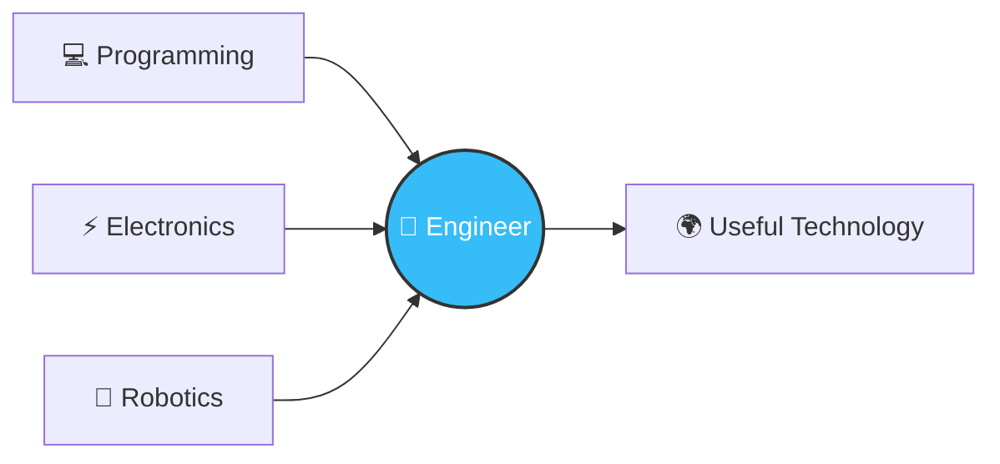

<div align="center">


<br>

[](https://hekaportfolio.web.app/)
[](https://youtube.com/@novemas12)


</div>

---

## 🧑‍💻 About Me

I'm **Novemas Heka Alfarizi**, a student from Indonesia who loves **programming, electronics, robotics, and technology**. Currently at **SMA Negeri 1 Lumajang**, chasing a future in **Software/Hardware Engineering**.

I enjoy turning ideas into real things — a **program, a website, an IoT device, or a full automation system.**

> 💡 **My philosophy**
> *Learn → Build → Break → Fix → Improve.* 🔁

<details>
<summary>🎲 <b>Click for a random fun fact about me</b></summary>
<br>

- 🌙 I do my best debugging at night, fueled by way too much coffee
- 🧩 I'd rather understand *why* code breaks than just fix it
- 🛠️ Half my folder names are "final_v2_ACTUALLY_final"
- 🚀 My dream project: a fully autonomous smart home built from scratch

</details>

---

## 🚀 Featured Project

<div align="center">

### 🌡️ Smartoring — Smart Room Monitoring & Control System

*ESP32-based IoT system with real-time monitoring, automatic relay control, and remote access via Blynk — built as part of an OPSI (Olimpiade Penelitian Siswa Indonesia) research project.*

`ESP32` `DHT22` `Blynk` `OLED` `Relay Automation` `Web Dashboard`

</div>

| Feature | Description |
|---|---|
| 📊 Live Monitoring | Real-time temperature & humidity tracking |
| 🤖 Auto Control | Relay-driven fan & humidifier automation |
| 📱 Remote Access | Full control via the Blynk app |
| 🖥️ Dashboard | Custom web dashboard for live data |

---

## 🛠️ Tech Stack

<div align="center">


</div>

<details>
<summary>📈 <b>Click to see my skill progress</b></summary>
<br>

```text
💻 C++              ███████████████░░░  75%  Algorithms
🐍 Python           ███████████████░░░  75%  Projects
🌐 Web Development  ████████████░░░░░░  60%  HTML • CSS • JS
🤖 Arduino / ESP32  █████████████░░░░░  65%  IoT & Robotics
⚡ Electronics       ███████████░░░░░░░  55%  Embedded Systems
🧠 Problem Solving  ████████████░░░░░░  60%  Logic & Algorithms
🇬🇧 English         █████████░░░░░░░░░  45%  Communication
```

</details>

---

## 🔨 Things I Like Building

<div align="center">

| 🔧 Area | 💡 Projects |
|---|---|
| 🤖 IoT | Sensors, monitoring & automation |
| ⚡ Electronics | Circuits, microcontrollers & control |
| 💻 Programming | Algorithms & useful applications |
| 🌐 Web | Websites & web applications |
| 🛠️ Automation | Systems that make tasks easier |
| 🧪 Experiments | Ideas, prototypes & random projects |

</div>

---

## 🎯 My Goal

> **Become a programmer who can build things, not just write code.**

I want to study **Electrical Engineering** and combine:

**💻 Programming + ⚡ Electronics + 🤖 Robotics + 🧠 Engineering**

...to create technology that is actually useful.



---

## 📚 Currently Learning

<div align="center">


</div>

---

## 📊 GitHub Activity

<div align="center">


<br>


<br><br>


</div>

---

## 🐍 Contribution Activity

<div align="center">


</div>

---

## 🌱 A Student in Progress

I'm still learning.

Some projects will fail. Some code will be terrible. Some ideas won't work.

**And that's exactly the point.**

<details>
<summary>💬 <b>Got feedback, ideas, or want to collaborate?</b></summary>
<br>

Drop by my [portfolio](https://hekaportfolio.web.app/) or check out builds on [YouTube](https://youtube.com/@novemas12) — always open to talking IoT, electronics, or code.

</details>

> **Still learning. Still building. Still improving. 🚀**

---

<div align="center">

### ⭐ Thanks for visiting my profile!

**Learn. Build. Master. 🚀**


</div>
